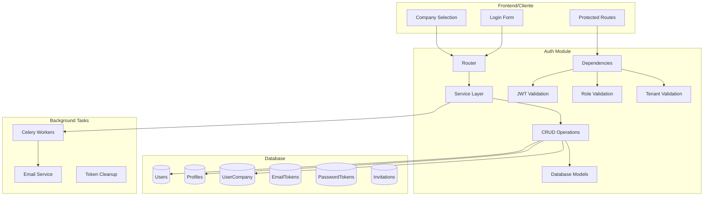
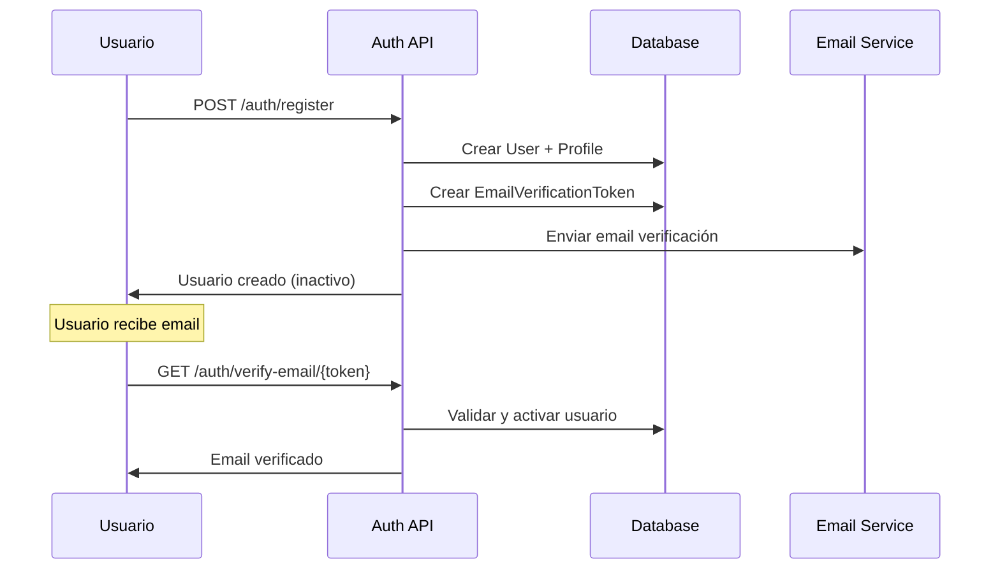
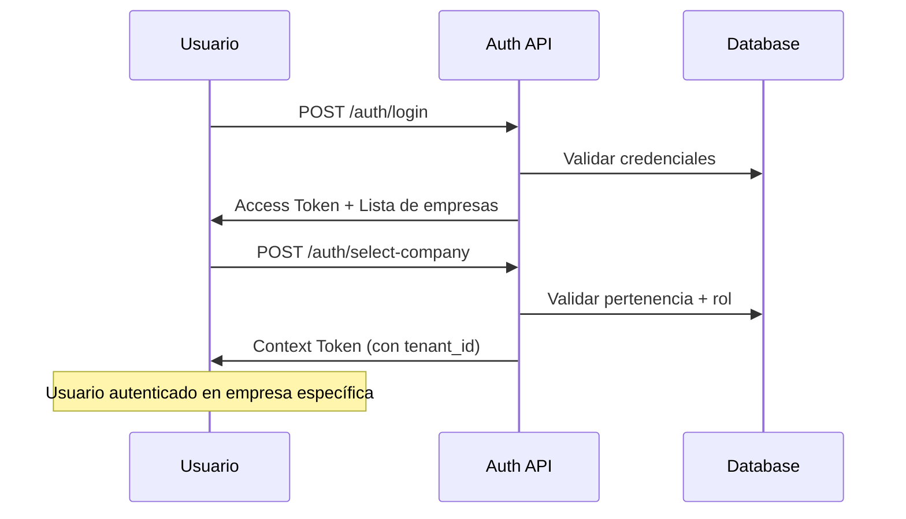
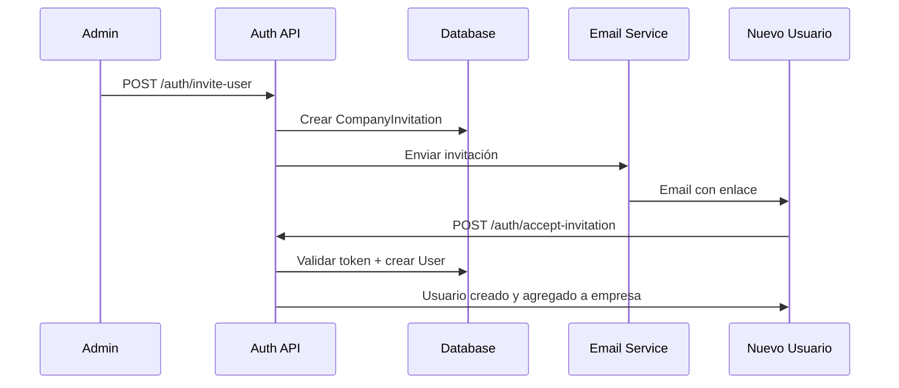

# 🔐 Auth Module - Sistema de Autenticación Multi-Tenant

Módulo completo de autenticación para **Ally360 ERP SaaS** que implementa autenticación JWT multi-tenant con gestión de roles, verificación de email, recuperación de contraseña e invitaciones por empresa.

## 📋 Índice

- [Características Principales](#características-principales)
- [Arquitectura del Sistema](#arquitectura-del-sistema)
- [Modelos de Datos](#modelos-de-datos)
- [Flujos de Autenticación](#flujos-de-autenticación)
- [Endpoints de la API](#endpoints-de-la-api)
- [Sistema de Roles y Permisos](#sistema-de-roles-y-permisos)
- [Configuración y Variables](#configuración-y-variables)
- [Ejemplos de Uso](#ejemplos-de-uso)
- [Seguridad](#seguridad)
- [Testing](#testing)

## ✨ Características Principales

### 🏢 **Multi-Tenancy Completo**
- Usuario puede pertenecer a múltiples empresas
- Roles específicos por empresa (owner, admin, seller, accountant, viewer)
- Aislamiento completo de datos por tenant
- Sistema de invitaciones por empresa

### 🔑 **Autenticación JWT Segura**
- **Doble token**: Access token + Context token
- Tokens de acceso de corta duración (30 min)
- Tokens de contexto para empresas específicas
- Refresh tokens con rotación automática
- Invalidación segura de sesiones

### 📧 **Sistema de Verificación**
- Verificación de email obligatoria
- Tokens seguros con expiración (24h)
- Reenvío de verificación disponible
- Templates de email personalizados

### 🔄 **Recuperación de Contraseña**
- Reset seguro con tokens temporales (1h)
- No revela existencia de cuentas
- Invalidación automática de tokens previos
- Notificaciones por email

### 👥 **Sistema de Invitaciones**
- Invitaciones por empresa con roles específicos
- Tokens únicos con expiración (7 días)
- Flujo completo: invitar → email → aceptar → registro
- Validaciones de permisos para invitar

## 🏗️ Arquitectura del Sistema



## 🗄️ Modelos de Datos

### **User (Usuario Principal)**
```python
class User(Base, TimestampMixin):
    id: UUID                    # Identificador único
    email: str                  # Email único del usuario
    password_hash: str          # Hash bcrypt de la contraseña
    is_active: bool            # Estado de la cuenta
    email_verified: bool       # Email verificado
    email_verified_at: datetime # Fecha de verificación
    last_login: datetime       # Último login exitoso
```

### **Profile (Perfil del Usuario)**
```python
class Profile(Base, TimestampMixin):
    id: UUID
    user_id: UUID              # FK a User
    first_name: str           # Nombre
    last_name: str            # Apellido
    phone: str                # Teléfono (opcional)
    avatar_url: str           # URL del avatar (opcional)
```

### **UserCompany (Relación Usuario-Empresa)**
```python
class UserCompany(Base, TimestampMixin):
    id: UUID
    user_id: UUID             # FK a User
    company_id: UUID          # FK a Company (tenant_id)
    role: UserRole            # Rol en la empresa
    is_active: bool           # Estado en la empresa
    joined_at: datetime       # Fecha de unión
```

### **Tokens de Seguridad**
- **EmailVerificationToken**: Verificación de email (24h)
- **PasswordResetToken**: Reset de contraseña (1h)
- **CompanyInvitation**: Invitaciones a empresas (7 días)

## 🔐 Flujos de Autenticación

### **1. Registro de Usuario**


### **2. Login Multi-Tenant**


### **3. Sistema de Invitaciones**


## 🌐 Endpoints de la API

### **Autenticación Principal**

| Método | Endpoint | Descripción | Autenticación |
|---------|----------|-------------|---------------|
| `POST` | `/auth/register` | Registro de nuevo usuario | No |
| `POST` | `/auth/login` | Login con email/password | No |
| `POST` | `/auth/select-company` | Seleccionar empresa | Access Token |
| `POST` | `/auth/refresh` | Renovar tokens | Refresh Token |
| `POST` | `/auth/logout` | Cerrar sesión | Context Token |

### **Verificación y Recuperación**

| Método | Endpoint | Descripción | Autenticación |
|---------|----------|-------------|---------------|
| `GET` | `/auth/verify-email/{token}` | Verificar email | No |
| `POST` | `/auth/resend-verification` | Reenviar verificación | No |
| `POST` | `/auth/forgot-password` | Solicitar reset contraseña | No |
| `POST` | `/auth/reset-password` | Cambiar contraseña con token | No |

### **Gestión de Invitaciones**

| Método | Endpoint | Descripción | Autenticación |
|---------|----------|-------------|---------------|
| `POST` | `/auth/invite-user` | Invitar usuario a empresa | Context Token + Role |
| `GET` | `/auth/invitations` | Listar invitaciones enviadas | Context Token |
| `POST` | `/auth/accept-invitation` | Aceptar invitación | No |
| `DELETE` | `/auth/invitations/{id}` | Cancelar invitación | Context Token + Role |

### **Perfil y Empresas**

| Método | Endpoint | Descripción | Autenticación |
|---------|----------|-------------|---------------|
| `GET` | `/auth/me` | Información del usuario | Context Token |
| `PUT` | `/auth/me` | Actualizar perfil | Context Token |
| `GET` | `/auth/companies` | Listar mis empresas | Access Token |
| `PUT` | `/auth/change-password` | Cambiar contraseña | Context Token |

## 👥 Sistema de Roles y Permisos

### **Jerarquía de Roles**
```python
class UserRole(str, Enum):
    OWNER = "owner"        # Propietario (todos los permisos)
    ADMIN = "admin"        # Administrador (gestión completa)
    SELLER = "seller"      # Vendedor (ventas y clientes)
    ACCOUNTANT = "accountant"  # Contador (facturas y reportes)
    VIEWER = "viewer"      # Solo lectura
```

### **Matriz de Permisos**

| Acción | Owner | Admin | Seller | Accountant | Viewer |
|--------|-------|-------|--------|------------|--------|
| Invitar usuarios | ✅ | ✅ | ❌ | ❌ | ❌ |
| Gestionar roles | ✅ | ✅ | ❌ | ❌ | ❌ |
| Ver facturas | ✅ | ✅ | ✅ | ✅ | ✅ |
| Crear facturas | ✅ | ✅ | ✅ | ❌ | ❌ |
| Ver reportes | ✅ | ✅ | ❌ | ✅ | ✅ |
| Configuración | ✅ | ✅ | ❌ | ❌ | ❌ |

### **Validación de Permisos**
```python
from app.modules.auth.dependencies import require_role

@router.get("/admin-only")
async def admin_endpoint(
    auth_context: AuthContext = Depends(require_role([UserRole.OWNER, UserRole.ADMIN]))
):
    """Endpoint solo para owners y admins"""
    return {"message": f"Hola {auth_context.user.profile.first_name}"}
```

## ⚙️ Configuración y Variables

### **Variables de Entorno**
```env
# JWT Configuration
JWT_SECRET_KEY=your-super-secret-key-here
JWT_ALGORITHM=HS256
JWT_ACCESS_TOKEN_EXPIRE_MINUTES=30
JWT_REFRESH_TOKEN_EXPIRE_DAYS=7

# Email Configuration
SMTP_SERVER=smtp.gmail.com
SMTP_PORT=587
SMTP_USERNAME=your-email@gmail.com
SMTP_PASSWORD=your-app-password
FROM_EMAIL=noreply@ally360.com
FROM_NAME=Ally360 ERP

# Security
BCRYPT_ROUNDS=12
TOKEN_URL=auth/token
```

### **Configuración de Celery**
```python
# Background tasks para emails
CELERY_BROKER_URL=redis://localhost:6379/0
CELERY_RESULT_BACKEND=redis://localhost:6379/0
```

## 💡 Ejemplos de Uso

### **Cliente Frontend - Login Completo**
```javascript
// 1. Login inicial
const loginResponse = await fetch('/auth/login', {
  method: 'POST',
  headers: { 'Content-Type': 'application/json' },
  body: JSON.stringify({
    email: 'user@example.com',
    password: 'password123'
  })
});

const { access_token, user, companies } = await loginResponse.json();

// 2. Seleccionar empresa
const companyResponse = await fetch('/auth/select-company', {
  method: 'POST',
  headers: {
    'Authorization': `Bearer ${access_token}`,
    'Content-Type': 'application/json'
  },
  body: JSON.stringify({
    company_id: companies[0].id
  })
});

const { context_token, company, role } = await companyResponse.json();

// 3. Usar context_token para requests protegidos
const protectedResponse = await fetch('/api/products', {
  headers: {
    'Authorization': `Bearer ${context_token}`,
    'X-Company-ID': company.id
  }
});
```

### **Invitar Usuario (Admin)**
```python
# Invitar nuevo usuario a la empresa
invite_data = InviteUserRequest(
    email="newuser@example.com",
    role=UserRole.SELLER,
    first_name="Juan",
    last_name="Pérez"
)

response = await auth_service.invite_user(
    db=db,
    company_id=current_company.id,
    invite_data=invite_data,
    invited_by=current_user.id
)
```

### **Validación de Roles en Endpoints**
```python
@router.post("/products")
async def create_product(
    product_data: ProductCreate,
    auth_context: AuthContext = Depends(
        require_role([UserRole.OWNER, UserRole.ADMIN, UserRole.SELLER])
    ),
    db: AsyncSession = Depends(get_db)
):
    """Solo owners, admins y sellers pueden crear productos"""
    product = await product_service.create(
        db=db,
        tenant_id=auth_context.tenant_id,
        product_data=product_data,
    created_by=auth_context.user_id
    )
    return product
```

## 🔒 Seguridad

### **Medidas de Seguridad Implementadas**

1. **Contraseñas Seguras**
   - Hash bcrypt con 12 rounds
   - Validación de complejidad en frontend
   - No almacenamiento de contraseñas en texto plano

2. **Tokens JWT Seguros**
   - Expiración corta (30 min access, 7 días refresh)
   - Algoritmo HS256 con secret robusto
   - Invalidación manual disponible

3. **Protección contra Ataques**
   - Rate limiting por IP y usuario
   - Validación estricta de entrada (Pydantic)
   - No exposición de información sensible en errores

4. **Aislamiento Multi-Tenant**
   - Validación obligatoria de tenant_id
   - Middleware de aislamiento automático
   - Queries siempre scoped por empresa

5. **Tokens de Verificación**
   - Generación criptográficamente segura (secrets)
   - Expiración automática
   - Un solo uso (no reutilizables)

### **Recomendaciones de Seguridad**

```python
# ✅ CORRECTO: Validar tenant ownership
@require_role([UserRole.ADMIN])
async def get_user_list(auth_context: AuthContext):
    # auth_context.tenant_id ya validado automáticamente
    users = await user_service.get_by_tenant(auth_context.tenant_id)
    
# ❌ INCORRECTO: No validar tenant
async def get_user_list(user_id: str):
    # Podría acceder a usuarios de otras empresas
    users = await user_service.get_all()
```

## 🧪 Testing

### **Test de Autenticación**
```python
class TestAuth:
    async def test_user_registration(self, client):
        """Test registro completo de usuario"""
        response = await client.post("/auth/register", json={
            "email": "test@example.com",
            "password": "Password123!",
            "first_name": "Test",
            "last_name": "User"
        })
        assert response.status_code == 201
        
    async def test_multi_tenant_isolation(self, client, user_factory):
        """Test que usuarios no accedan a datos de otras empresas"""
        # Crear dos usuarios en empresas diferentes
        user1 = await user_factory(company_id="company-1")
        user2 = await user_factory(company_id="company-2")
        
        # user1 no debe ver datos de company-2
        token1 = create_context_token(user1, "company-1")
        response = await client.get(
            "/api/products",
            headers={"Authorization": f"Bearer {token1}"}
        )
        # Productos solo de company-1
        assert all(p["tenant_id"] == "company-1" for p in response.json())
```

### **Test de Roles y Permisos**
```python
@pytest.mark.parametrize("role,expected_status", [
    (UserRole.OWNER, 200),
    (UserRole.ADMIN, 200),
    (UserRole.SELLER, 403),
    (UserRole.VIEWER, 403),
])
async def test_role_permissions(client, role, expected_status):
    """Test permisos por rol"""
    token = create_context_token_with_role(role)
    response = await client.post(
        "/auth/invite-user",
        headers={"Authorization": f"Bearer {token}"},
        json={"email": "new@example.com", "role": "seller"}
    )
    assert response.status_code == expected_status
```

## 🔄 Integración con Otros Módulos

### **Middleware de Tenant**
```python
# El AuthContext se propaga automáticamente
request.state.tenant_id = auth_context.tenant_id
request.state.user_id = auth_context.user_id
request.state.user_role = auth_context.role
```

### **Auditoría Automática**
```python
# Logs automáticos de acciones críticas
await audit_service.log_action(
    tenant_id=auth_context.tenant_id,
    user_id=auth_context.user_id,
    action="USER_INVITED",
    details={"invited_email": invite_data.email}
)
```

---

## 🚀 **Próximas Mejoras**

- [ ] **OAuth2 Social Login** (Google, Microsoft)
- [ ] **Two-Factor Authentication (2FA)**
- [ ] **Session Management** avanzado
- [ ] **API Keys** para integraciones
- [ ] **Advanced Role Permissions** (granular)
- [ ] **Audit Trail** completo
- [ ] **Rate Limiting** por tenant
- [ ] **Device Management** (confianza de dispositivos)

---

**Versión del módulo:** 1.0.0  
**Compatibilidad:** FastAPI 0.104+, SQLAlchemy 2.0+, Pydantic 2.0+