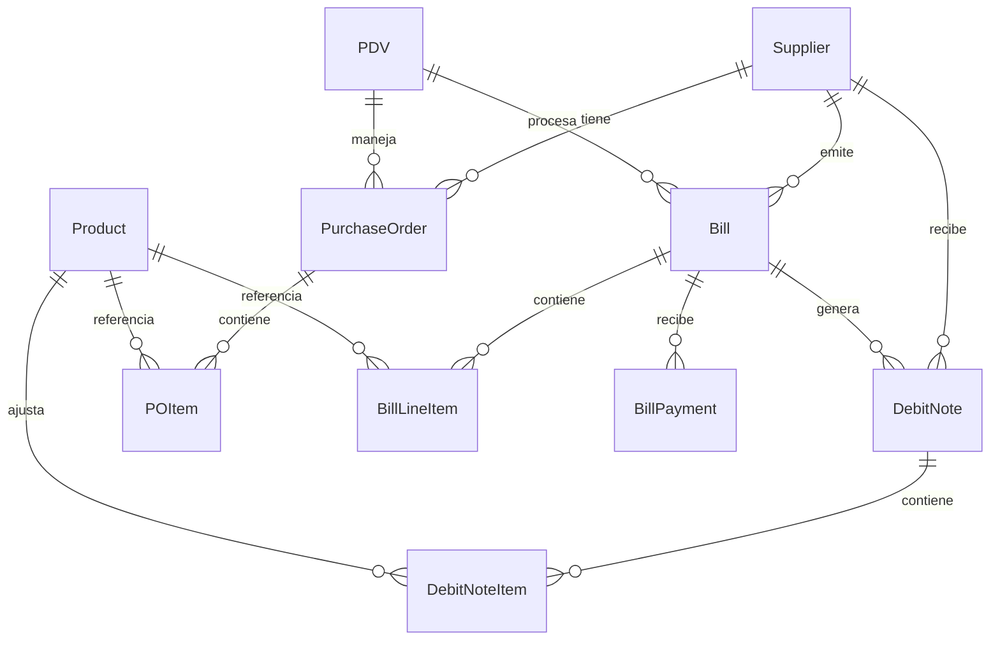

# Módulo de Gastos (Bills) - Ally360 ERP

## 📄 Descripción General

El módulo de **Gastos (Bills)** es un componente fundamental del ERP Ally360 que maneja toda la cadena de compras y gastos de la empresa. Desde la gestión de proveedores hasta el control de pagos, pasando por órdenes de compra y facturas con integración automática al inventario.

## 🏗️ Arquitectura del Sistema

### Entidades Principales



### Flujo de Estados

#### Órdenes de Compra (PurchaseOrder)
```
draft → sent → approved → closed
  ↓       ↓       ↓         ↓
void    void    void      void
```

#### Facturas (Bill)
```
draft → open → partial → paid
  ↓       ↓       ↓        ↓
void    void    void     void
```

#### Notas Débito (DebitNote)
```
open → void
```

## 🚀 Funcionalidades

### 1. Gestión de Proveedores

- **CRUD completo** de proveedores
- **Validación de documentos únicos** por empresa
- **Búsqueda avanzada** por nombre, documento o email
- **Control de eliminación** (no se puede eliminar si tiene facturas)

### 2. Órdenes de Compra

- **Creación de órdenes** con múltiples ítems
- **Cálculo automático de totales** con impuestos
- **Conversión a facturas** con un solo clic
- **Estados controlados** (draft, sent, approved, closed, void)
- **No afectan inventario** hasta convertirse en facturas

### 3. Facturas de Proveedor

- **Creación independiente** o desde órdenes de compra
- **Integración automática con inventario** cuando están en estado 'open'
- **Cálculo de impuestos** integrado con el módulo de taxes
- **Control de estados** automático basado en pagos
- **Validación de productos** y PDVs por empresa

### 4. Gestión de Pagos

- **Pagos parciales y completos** con control automático
- **Múltiples métodos de pago** (efectivo, transferencia, tarjeta, otros)
- **Actualización automática de estados** de facturas
- **Validación de montos** (no exceder saldo pendiente)
- **Historial completo** de pagos por factura

### 5. Notas Débito

- **Tres tipos de ajustes**:
  - `price_adjustment`: Ajuste de precios (no afecta inventario)
  - `quantity_adjustment`: Ajuste de cantidades (afecta inventario)
  - `service`: Servicios adicionales
- **Integración con inventario** para ajustes de cantidad
- **Asociación opcional** con facturas específicas

## 🔧 Integración con Otros Módulos

### Módulo de Inventario

```python
# Cuando una Bill cambia a estado 'open'
def _update_inventory_for_bill(bill, movement_type="IN"):
    for item in bill.line_items:
        # 1. Actualizar stock
        stock.quantity += item.quantity
        
        # 2. Crear movimiento
        movement = InventoryMovement(
            type="IN",
            quantity=item.quantity,
            reference_type="bill",
            reference_id=str(bill.id)
        )
```

### Módulo de Taxes

```python
# Cálculo automático de impuestos por línea
def calculate_line_taxes(product_id, base_amount, company_id):
    # Obtiene impuestos del producto
    # Calcula valores según legislación colombiana
    # Retorna: line_taxes (JSON), taxes_amount (Decimal)
```

### Módulo de Auth

- **Validación de roles** en todos los endpoints
- **Context de empresa** automático desde JWT
- **Auditoría de operaciones** con created_by

## 📊 API Endpoints

### Proveedores (`/suppliers`)

| Método | Endpoint | Descripción | Roles |
|--------|----------|-------------|-------|
| POST | `/` | Crear proveedor | owner, admin, seller |
| GET | `/` | Listar proveedores | todos |
| GET | `/{id}` | Ver proveedor | todos |
| PATCH | `/{id}` | Actualizar proveedor | owner, admin, seller |
| DELETE | `/{id}` | Eliminar proveedor | owner, admin |

### Órdenes de Compra (`/purchase-orders`)

| Método | Endpoint | Descripción | Roles |
|--------|----------|-------------|-------|
| POST | `/` | Crear orden | owner, admin, seller |
| GET | `/` | Listar órdenes | todos |
| GET | `/{id}` | Ver orden | todos |
| POST | `/{id}/convert-to-bill` | Convertir a factura | owner, admin, seller |
| POST | `/{id}/void` | Anular orden | owner, admin |

### Facturas (`/bills`)

| Método | Endpoint | Descripción | Roles |
|--------|----------|-------------|-------|
| POST | `/` | Crear factura | owner, admin, seller |
| GET | `/` | Listar facturas | todos |
| GET | `/{id}` | Ver factura | todos |
| PATCH | `/{id}` | Actualizar (solo draft) | owner, admin, seller |
| POST | `/{id}/void` | Anular factura | owner, admin |
| POST | `/{id}/payments` | Registrar pago | owner, admin, seller, accountant |
| GET | `/{id}/payments` | Ver pagos | todos |

### Notas Débito (`/debit-notes`)

| Método | Endpoint | Descripción | Roles |
|--------|----------|-------------|-------|
| POST | `/` | Crear nota débito | owner, admin, seller |
| GET | `/` | Listar notas | todos |
| GET | `/{id}` | Ver nota | todos |
| PATCH | `/{id}` | Actualizar nota | owner, admin, seller |
| POST | `/{id}/void` | Anular nota | owner, admin |

## 🔒 Seguridad y Validaciones

### Multi-tenancy
- Todas las queries filtradas por `company_id`
- Validación automática de pertenencia de entidades
- Aislamiento completo entre empresas

### Validaciones de Negocio
- **Productos y PDVs** deben pertenecer a la empresa
- **Proveedores únicos** por documento (opcional)
- **Pagos no pueden exceder** el saldo pendiente
- **Estados controlados** con transiciones válidas
- **Facturas draft** no afectan inventario

### Control de Acceso
- **Roles jerárquicos**: owner > admin > seller > accountant > viewer
- **Operaciones críticas** solo para owner/admin
- **Auditoría completa** con created_by y timestamps

## 📋 Casos de Uso Principales

### 1. Flujo de Compra Completo
```python
# 1. Crear orden de compra
po = create_purchase_order({
    "supplier_id": "uuid-proveedor",
    "pdv_id": "uuid-pdv",
    "items": [...]
})

# 2. Convertir a factura
bill = convert_po_to_bill(po.id, {
    "bill_number": "F-001",
    "status": "open"  # Actualiza inventario automáticamente
})

# 3. Registrar pagos
payment = add_bill_payment(bill.id, {
    "amount": 100000,
    "method": "transfer"
})  # Cambia estado automáticamente si se paga completo
```

### 2. Ajustes con Notas Débito
```python
# Ajuste de cantidad (afecta inventario)
debit_note = create_debit_note({
    "supplier_id": "uuid-proveedor",
    "items": [{
        "product_id": "uuid-producto",
        "reason_type": "quantity_adjustment",
        "quantity": 5  # Incrementa stock automáticamente
    }]
})

# Ajuste de precio (no afecta inventario)
debit_note = create_debit_note({
    "supplier_id": "uuid-proveedor", 
    "items": [{
        "name": "Ajuste precio producto X",
        "reason_type": "price_adjustment",
        "unit_price": 50000
    }]
})
```

## 🧪 Pruebas de Aceptación

### ✅ Casos Implementados
1. **Crear PurchaseOrder draft** → no afecta stock ✓
2. **Convertir PurchaseOrder a Bill open** → stock incrementa + movements IN ✓
3. **Crear Bill open** → stock incrementa + movements IN ✓
4. **Crear Bill draft** → no afecta stock ✓
5. **Registrar pagos parciales/total** → saldo y estado se actualizan ✓

### 🚧 Casos Pendientes
6. **Bill draft→open** → stock incrementa
7. **Nota débito price_adjustment** → no afecta stock
8. **Nota débito quantity_adjustment** → stock incrementa + movement IN
9. **Void Bill** → estado cambia, stock no revierte en MVP
10. **Listados y filtros** respetan company_id

## 🚀 Roadmap y Mejoras Futuras

### Versión 1.1
- [ ] Completar servicios de DebitNote
- [ ] Implementar anulación de facturas y órdenes
- [ ] Agregar validaciones de límites por plan
- [ ] Reportes de compras por período

### Versión 1.2
- [ ] Adjuntos de archivos a facturas
- [ ] Comentarios y notas internas
- [ ] Aprobaciones de órdenes de compra
- [ ] Integración con contabilidad

### Versión 1.3
- [ ] Reversión automática de inventario en anulaciones
- [ ] Descuentos por línea y globales
- [ ] Múltiples monedas con conversión
- [ ] Integración con bancos para pagos

## 📝 Notas de Desarrollo

### Patrones Utilizados
- **Repository Pattern**: Servicios separados por entidad
- **Command Pattern**: Operaciones complejas como métodos específicos
- **Observer Pattern**: Actualizaciones automáticas de estado
- **Factory Pattern**: Creación de movimientos de inventario

### Consideraciones de Performance
- **Índices en campos filtro**: company_id, status, supplier_id, pdv_id
- **Paginación obligatoria** en listados
- **Eager loading** para relaciones frecuentes
- **Transacciones atómicas** para operaciones críticas

### Logging y Monitoreo
- **Eventos críticos**: Cambios de estado, actualizaciones de inventario
- **Métricas de negocio**: Tiempo promedio de pago, facturas vencidas
- **Alertas**: Facturas sin pagar, errores de inventario

---

*Documentación actualizada: Septiembre 2025*  
*Versión del módulo: 1.0.0*