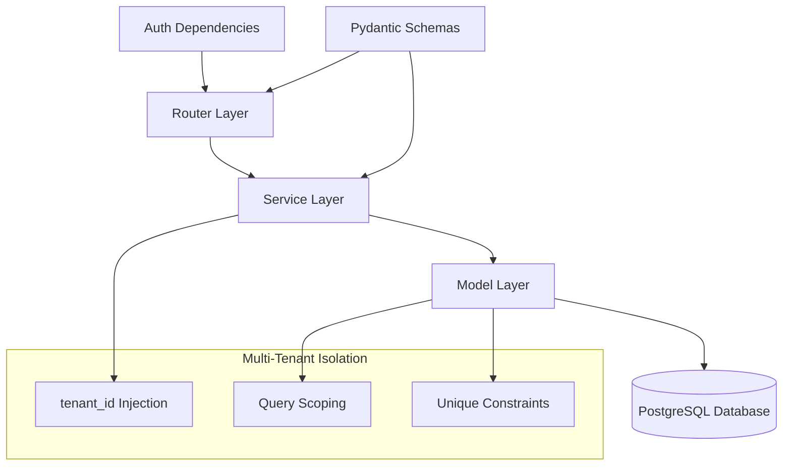

# 🏷️ Brands Module - Gestión de Marcas

**Módulo de Marcas** para el ERP SaaS multi-tenant **Ally360** - Gestión completa de marcas de productos con arquitectura escalable y segura.

## 📋 Índice

- [Características Principales](#características-principales)
- [Arquitectura](#arquitectura)
- [Modelo de Datos](#modelo-de-datos)
- [API Reference](#api-reference)
- [Service Layer](#service-layer)
- [Validaciones](#validaciones)
- [Seguridad y Permisos](#seguridad-y-permisos)
- [Ejemplos de Uso](#ejemplos-de-uso)
- [Integración](#integración)
- [Testing](#testing)

## ✨ Características Principales

### **🎯 Funcionalidades Core**
- ✅ **CRUD completo** - Crear, leer, actualizar, eliminar marcas
- ✅ **Multi-tenant isolation** - Aislamiento perfecto por empresa
- ✅ **Unicidad por tenant** - Mismo nombre permitido en diferentes empresas
- ✅ **Paginación eficiente** - Listados con límites configurables
- ✅ **Estado activo/inactivo** - Control de visibilidad
- ✅ **Integración con productos** - Preparado para foreign key relationships

### **🛡️ Seguridad y Validaciones**
- ✅ **Role-based permissions** - Control de acceso por roles
- ✅ **Input validation** - Validaciones estrictas con Pydantic
- ✅ **Error handling** - Manejo robusto de excepciones
- ✅ **Transactional operations** - Rollback automático en errores

## 🏗️ Arquitectura

### **Patrón de Capas**


### **Principios Arquitectónicos**
- **Separation of Concerns**: Router → Service → Model → Database
- **Dependency Injection**: AuthContext automático con tenant_id
- **Error Boundaries**: Try/catch en cada capa con rollback
- **Single Responsibility**: Cada clase tiene una responsabilidad clara

## 🗄️ Modelo de Datos

### **Tabla Brands**
```sql
CREATE TABLE brands (
    id UUID PRIMARY KEY DEFAULT gen_random_uuid(),
    tenant_id UUID NOT NULL,                    -- Multi-tenant isolation
    name VARCHAR(100) NOT NULL,                 -- Nombre de la marca
    description VARCHAR(255),                   -- Descripción opcional
    is_active BOOLEAN DEFAULT true,             -- Estado activo/inactivo
    created_at TIMESTAMPTZ DEFAULT NOW(),       -- Timestamp de creación
    updated_at TIMESTAMPTZ DEFAULT NOW(),       -- Timestamp de actualización
    
    -- Constraints
    CONSTRAINT uq_brand_tenant_name UNIQUE (tenant_id, name)
);

-- Índices para performance
CREATE INDEX idx_brands_tenant_id ON brands(tenant_id);
CREATE INDEX idx_brands_name ON brands(name);
CREATE INDEX idx_brands_active ON brands(tenant_id, is_active);
```

### **Campos Detallados**
| Campo | Tipo | Descripción | Restricciones |
|-------|------|-------------|---------------|
| `id` | UUID | Identificador único | Primary Key, auto-generado |
| `tenant_id` | UUID | ID de la empresa | NOT NULL, foreign key |
| `name` | VARCHAR(100) | Nombre de la marca | NOT NULL, único por tenant |
| `description` | VARCHAR(255) | Descripción opcional | Nullable |
| `is_active` | BOOLEAN | Estado activo | Default: true |
| `created_at` | TIMESTAMPTZ | Fecha de creación | Auto-generado |
| `updated_at` | TIMESTAMPTZ | Fecha de actualización | Auto-updated |

## 🌐 API Reference

### **Endpoints Disponibles**

| Método | Endpoint | Descripción | Roles Permitidos |
|--------|----------|-------------|------------------|
| `POST` | `/brands` | Crear nueva marca | owner, admin |
| `GET` | `/brands` | Listar marcas con paginación | todos |
| `GET` | `/brands/{id}` | Obtener marca específica | todos |
| `PATCH` | `/brands/{id}` | Actualizar marca | owner, admin |
| `DELETE` | `/brands/{id}` | Eliminar marca | owner, admin |

#### **POST /brands - Crear Marca**
```http
POST /brands
Content-Type: application/json
Authorization: Bearer {context_token}

{
  "name": "Apple",
  "description": "Productos tecnológicos premium"
}

Response (201):
{
  "id": "550e8400-e29b-41d4-a716-446655440000",
  "name": "Apple",
  "description": "Productos tecnológicos premium",
  "is_active": true,
  "created_at": "2025-09-28T10:00:00Z"
}
```

#### **GET /brands - Listar Marcas**
```http
GET /brands?limit=20&offset=0
Authorization: Bearer {context_token}

Response (200):
{
  "brands": [
    {
      "id": "550e8400-e29b-41d4-a716-446655440000", 
      "name": "Apple",
      "description": "Productos tecnológicos premium",
      "is_active": true,
      "created_at": "2025-09-28T10:00:00Z"
    }
  ],
  "total": 45,
  "limit": 20,
  "offset": 0
}
```

#### **PATCH /brands/{id} - Actualizar Marca**
```http
PATCH /brands/550e8400-e29b-41d4-a716-446655440000
Content-Type: application/json
Authorization: Bearer {context_token}

{
  "description": "Productos tecnológicos premium y innovadores"
}
```

#### **DELETE /brands/{id} - Eliminar Marca**
```http
DELETE /brands/550e8400-e29b-41d4-a716-446655440000
Authorization: Bearer {context_token}

Response (204): No Content
```

## ⚙️ Service Layer

### **BrandService Class**
```python
from sqlalchemy.orm import Session
from sqlalchemy.exc import IntegrityError
from fastapi import HTTPException, status
from uuid import UUID
from typing import Dict, Any

class BrandService:
    """Servicio para gestión de marcas con arquitectura robusta"""
    
    def __init__(self, db: Session):
        self.db = db

    def create_brand(self, brand_data: BrandCreate, tenant_id: UUID, user_id: UUID) -> Brand:
        """Crear nueva marca con validaciones completas"""
        try:
            # Verificar unicidad por tenant
            existing = self.db.query(Brand).filter(
                Brand.name == brand_data.name,
                Brand.tenant_id == tenant_id
            ).first()
            
            if existing:
                raise HTTPException(
                    status_code=status.HTTP_409_CONFLICT,
                    detail=f"Ya existe una marca con el nombre '{brand_data.name}'"
                )

            brand = Brand(
                name=brand_data.name,
                description=brand_data.description,
                tenant_id=tenant_id
            )
            
            self.db.add(brand)
            self.db.commit()
            self.db.refresh(brand)
            return brand
            
        except HTTPException:
            raise
        except IntegrityError:
            self.db.rollback()
            raise HTTPException(409, "Error de integridad")
        except Exception as e:
            self.db.rollback()
            raise HTTPException(500, f"Error interno: {str(e)}")

    def get_all_brands(self, tenant_id: UUID, limit: int = 100, offset: int = 0):
        """Listar marcas con paginación"""
        try:
            query = self.db.query(Brand).filter(Brand.tenant_id == tenant_id)
            total = query.count()
            brands = query.offset(offset).limit(limit).all()
            
            return {
                "brands": brands,
                "total": total,
                "limit": limit,
                "offset": offset
            }
        except Exception as e:
            raise HTTPException(500, f"Error listando marcas: {str(e)}")

    def get_brand_by_id(self, brand_id: UUID, tenant_id: UUID) -> Brand:
        """Obtener marca por ID"""
        brand = self.db.query(Brand).filter(
            Brand.id == brand_id,
            Brand.tenant_id == tenant_id
        ).first()
        
        if not brand:
            raise HTTPException(404, "Marca no encontrada")
        return brand

    def update_brand(self, brand_id: UUID, update_data: BrandUpdate, tenant_id: UUID, user_id: UUID):
        """Actualizar marca"""
        try:
            brand = self.get_brand_by_id(brand_id, tenant_id)
            
            # Verificar unicidad del nombre si se actualiza
            if update_data.name and update_data.name != brand.name:
                existing = self.db.query(Brand).filter(
                    Brand.name == update_data.name,
                    Brand.tenant_id == tenant_id,
                    Brand.id != brand_id
                ).first()
                
                if existing:
                    raise HTTPException(409, f"Ya existe otra marca con el nombre '{update_data.name}'")
            
            # Actualizar campos
            update_dict = update_data.model_dump(exclude_unset=True)
            for field, value in update_dict.items():
                setattr(brand, field, value)
            
            self.db.commit()
            self.db.refresh(brand)
            return brand
            
        except HTTPException:
            raise
        except Exception as e:
            self.db.rollback()
            raise HTTPException(500, f"Error actualizando marca: {str(e)}")

    def delete_brand(self, brand_id: UUID, tenant_id: UUID):
        """Eliminar marca"""
        try:
            brand = self.get_brand_by_id(brand_id, tenant_id)
            
            # TODO: Verificar si tiene productos asociados
            
            self.db.delete(brand)
            self.db.commit()
            return {"message": "Marca eliminada exitosamente"}
            
        except HTTPException:
            raise
        except Exception as e:
            self.db.rollback()
            raise HTTPException(500, f"Error eliminando marca: {str(e)}")
```

## ✅ Validaciones

### **Pydantic Schemas**
```python
from pydantic import BaseModel, Field
from typing import Optional
from uuid import UUID
from datetime import datetime

class BrandCreate(BaseModel):
    name: str = Field(..., min_length=1, max_length=100, description="Nombre de la marca")
    description: Optional[str] = Field(None, max_length=255, description="Descripción opcional")

class BrandUpdate(BaseModel):
    name: Optional[str] = Field(None, min_length=1, max_length=100)
    description: Optional[str] = Field(None, max_length=255)

class BrandOut(BaseModel):
    id: UUID
    name: str
    description: Optional[str] = None
    is_active: bool = True
    created_at: datetime

    class Config:
        from_attributes = True  # Pydantic v2
```

### **Validaciones de Negocio**
1. **Unicidad por Tenant**: Nombre único dentro de cada empresa
2. **Longitud de Campos**: 
   - `name`: 1-100 caracteres (requerido)
   - `description`: 0-255 caracteres (opcional)
3. **Tenant Isolation**: Automático via AuthContext
4. **Estado Válido**: `is_active` siempre boolean

## 🛡️ Seguridad y Permisos

### **Matriz de Permisos**
| Acción | Owner | Admin | Seller | Accountant | Viewer |
|--------|-------|-------|--------|------------|--------|
| **Crear marca** | ✅ | ✅ | ❌ | ❌ | ❌ |
| **Editar marca** | ✅ | ✅ | ❌ | ❌ | ❌ |
| **Eliminar marca** | ✅ | ✅ | ❌ | ❌ | ❌ |
| **Ver marcas** | ✅ | ✅ | ✅ | ✅ | ✅ |

### **Validaciones de Seguridad**
- **Tenant isolation**: Queries automáticamente scoped por `tenant_id`
- **Role validation**: Decorador `@require_role()` en endpoints
- **Input validation**: Pydantic schemas con length limits
- **SQL injection**: Protección automática con SQLAlchemy ORM

## 💡 Ejemplos de Uso

### **Frontend JavaScript**
```javascript
// Crear marca
const createBrand = async (brandData) => {
  const response = await fetch('/brands', {
    method: 'POST',
    headers: {
      'Authorization': `Bearer ${contextToken}`,
      'Content-Type': 'application/json'
    },
    body: JSON.stringify(brandData)
  });
  
  if (!response.ok) {
    throw new Error('Error creando marca');
  }
  
  return await response.json();
};

// Componente React para selector
const BrandSelector = ({ onSelect }) => {
  const [brands, setBrands] = useState([]);
  
  useEffect(() => {
    fetch('/brands', {
      headers: { 'Authorization': `Bearer ${contextToken}` }
    })
    .then(res => res.json())
    .then(data => setBrands(data.brands));
  }, []);
  
  return (
    <select onChange={(e) => onSelect(e.target.value)}>
      <option value="">Seleccionar marca...</option>
      {brands.map(brand => (
        <option key={brand.id} value={brand.id}>
          {brand.name}
        </option>
      ))}
    </select>
  );
};
```

### **Python Client**
```python
import requests

class BrandClient:
    def __init__(self, base_url: str, token: str):
        self.base_url = base_url
        self.headers = {
            'Authorization': f'Bearer {token}',
            'Content-Type': 'application/json'
        }
    
    def create_brand(self, name: str, description: str = None):
        data = {'name': name}
        if description:
            data['description'] = description
            
        response = requests.post(
            f'{self.base_url}/brands',
            json=data,
            headers=self.headers
        )
        response.raise_for_status()
        return response.json()
    
    def get_brands(self, limit: int = 100, offset: int = 0):
        params = {'limit': limit, 'offset': offset}
        response = requests.get(
            f'{self.base_url}/brands',
            params=params,
            headers=self.headers
        )
        response.raise_for_status()
        return response.json()

# Uso
client = BrandClient('https://api.ally360.com', context_token)
new_brand = client.create_brand('Samsung', 'Electrónicos y tecnología')
brands_list = client.get_brands(limit=50)
```

## 🔗 Integración

### **Con Módulo Products**
```sql
-- Relación preparada para productos
ALTER TABLE products ADD COLUMN brand_id UUID REFERENCES brands(id);

-- Query para productos por marca
SELECT p.*, b.name as brand_name 
FROM products p 
LEFT JOIN brands b ON p.brand_id = b.id 
WHERE p.tenant_id = ? AND b.tenant_id = ?;
```

### **Endpoints de Integración Futuros**
```http
GET /brands/{id}/products-count    # Contar productos de la marca
GET /brands/{id}/can-delete        # Verificar si se puede eliminar
```

## 🧪 Testing

### **Test Cases Críticos**
```python
class TestBrands:
    
    async def test_create_brand_success(self, client, auth_context):
        """Test crear marca exitosamente"""
        response = await client.post("/brands", json={
            "name": "Nike",
            "description": "Ropa deportiva"
        })
        assert response.status_code == 201
        assert response.json()["name"] == "Nike"
    
    async def test_duplicate_brand_same_tenant(self, client, auth_context):
        """Test error al crear marca duplicada en mismo tenant"""
        # Crear primera marca
        await client.post("/brands", json={"name": "Adidas"})
        
        # Intentar crear duplicada
        response = await client.post("/brands", json={"name": "Adidas"})
        assert response.status_code == 409
        assert "Ya existe una marca" in response.json()["detail"]
    
    async def test_same_name_different_tenants(self, client):
        """Test permitir mismo nombre en diferentes tenants"""
        # Crear marca en tenant A
        response_a = await client.post("/brands", 
            json={"name": "Apple"},
            headers={"X-Company-ID": "tenant-a"}
        )
        assert response_a.status_code == 201
        
        # Crear marca con mismo nombre en tenant B
        response_b = await client.post("/brands",
            json={"name": "Apple"}, 
            headers={"X-Company-ID": "tenant-b"}
        )
        assert response_b.status_code == 201
    
    async def test_tenant_isolation(self, client):
        """Test que un tenant no ve marcas de otro"""
        # Crear marca en tenant A
        await client.post("/brands",
            json={"name": "Private Brand"},
            headers={"X-Company-ID": "tenant-a"}
        )
        
        # Buscar desde tenant B
        response = await client.get("/brands",
            headers={"X-Company-ID": "tenant-b"}
        )
        brands = response.json()["brands"]
        assert not any(b["name"] == "Private Brand" for b in brands)
```

---

## 🚀 Roadmap

### **v1.1 - Q4 2025**
- [ ] **Logo management**: Subida de imágenes con MinIO
- [ ] **Search functionality**: Búsqueda por nombre con filtros
- [ ] **Brand analytics**: Estadísticas de uso en productos
- [ ] **Import/Export**: CSV masivo de marcas

### **v1.2 - Q1 2026**  
- [ ] **Brand hierarchy**: Marcas padre e hijas
- [ ] **Advanced permissions**: Permisos granulares por marca
- [ ] **API webhooks**: Notificaciones de cambios
- [ ] **Audit trail**: Log de todas las modificaciones

---

**Versión:** 1.0.0  
**Compatibilidad:** FastAPI 0.104+, SQLAlchemy 2.0+, Pydantic 2.0+