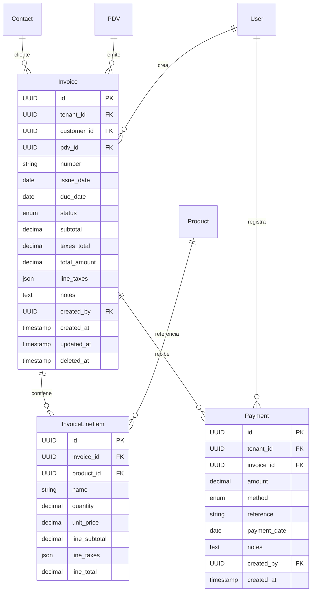

# Módulo de Facturas de Venta (Invoices) - Ally360 ERP

## 📄 Descripción General

El módulo de **Facturas de Venta (Invoices)** es un componente central del ERP Ally360 que gestiona todo el ciclo de facturación de ventas. Desde la creación de facturas hasta el control de pagos, integrándose automáticamente con el inventario y proporcionando reportes de ventas completos.

## 🏗️ Arquitectura del Sistema

### Entidades Principales



### Flujo de Estados

#### Facturas (Invoice)
```
draft → open → partial → paid
  ↓       ↓       ↓        ↓
void    void    void     void
```

- **draft**: Borrador, editable, no afecta inventario
- **open**: Confirmada, afecta inventario, no editable
- **partial**: Con pagos parciales
- **paid**: Totalmente pagada
- **void**: Anulada (solo owner/admin)

#### Pagos (Payment)
Los pagos no tienen estados, pero actualizan automáticamente el estado de la factura:
- Si `suma_pagos >= total_factura` → estado cambia a **paid**
- Si `suma_pagos > 0 && suma_pagos < total_factura` → estado cambia a **partial**

## 🚀 Funcionalidades

### 1. Gestión de Facturas

- **Creación de facturas** con múltiples ítems y cálculo automático de totales
- **Estados controlados** con validaciones de transición
- **Integración automática con inventario** cuando se confirman (draft → open)
- **Numeración automática** por PDV con validación de unicidad
- **Cálculo de impuestos** integrado con el módulo de taxes
- **Fechas de vencimiento** con validaciones de consistencia

### 2. Gestión de Clientes

- **Integración completa con módulo Contacts** para clientes unificados
- **Validación de clientes** con tipo 'client' en el sistema de contactos
- **Términos de pago** y límites de crédito por cliente
- **Historial de facturas** por cliente

### 3. Control de Inventario

- **Reducción automática de stock** cuando factura pasa a estado 'open'
- **Creación de movimientos** de inventario (OUT) con referencia a factura
- **Validación de stock disponible** antes de confirmar facturas
- **Reversión de movimientos** al anular facturas (futuro)

### 4. Gestión de Pagos

- **Pagos parciales y completos** con control automático de estados
- **Múltiples métodos de pago** (efectivo, transferencia, tarjeta, cheque, otros)
- **Referencias de pago** para trazabilidad
- **Historial completo** de pagos por factura
- **Validación de montos** (no negativos, no exceder saldo)

### 5. Reportes y Análisis

- **Resúmenes de ventas** por período con filtros por PDV
- **Estados de facturas** y análisis de pagos
- **Métricas de negocio** como tiempo promedio de pago
- **Exportación de reportes** (futuro)

## 🔧 Integración con Otros Módulos

### Módulo de Contacts

```python
# Clientes son Contacts con type='client'
from app.modules.contacts.service import ContactService

# Validar cliente en Invoices
contact = CustomerValidator(db).require_customer(customer_id, tenant_id)
# Retorna Contact con validaciones de tipo client
```

### Módulo de Inventario

```python
# Cuando una Invoice cambia a estado 'open'
def _update_inventory_for_invoice(invoice, movement_type="OUT"):
    for item in invoice.line_items:
        # 1. Reducir stock
        stock.quantity -= int(item.quantity)
        
        # 2. Crear movimiento
        movement = InventoryMovement(
            product_id=item.product_id,
            movement_type="OUT",
            quantity=int(item.quantity),
            reference=str(invoice.id),
            created_by=invoice.created_by
        )
```

### Módulo de Taxes

```python
# Cálculo automático de impuestos por línea
def calculate_line_taxes(product_id, base_amount, tenant_id):
    # Obtiene impuestos del producto
    # Calcula valores según legislación colombiana DIAN
    # Retorna: line_taxes (JSON), taxes_amount (Decimal)
```

### Módulo de PDV

- **Numeración secuencial** por punto de venta
- **Validación de PDV activo** y pertenencia a tenant
- **Configuraciones específicas** por PDV (resolución DIAN, etc.)

## 📊 API Endpoints

### Facturas (`/invoices`)

| Método | Endpoint | Descripción | Roles |
|--------|----------|-------------|-------|
| POST | `/` | Crear factura | owner, admin, seller |
| GET | `/` | Listar facturas | todos |
| GET | `/{id}` | Ver factura | todos |
| PATCH | `/{id}` | Actualizar (solo draft) | owner, admin, seller |
| POST | `/{id}/confirm` | Confirmar factura | owner, admin, seller |
| POST | `/{id}/cancel` | Anular factura | owner, admin |
| POST | `/{id}/payments` | Registrar pago | owner, admin, seller, accountant |
| GET | `/{id}/payments` | Ver pagos | todos |
| GET | `/{id}/pdf` | Descargar PDF | todos |
| POST | `/{id}/email` | Enviar por email | owner, admin, seller, accountant |

### Reportes (`/invoices/reports`)

| Método | Endpoint | Descripción | Roles |
|--------|----------|-------------|-------|
| GET | `/summary` | Resumen de ventas | owner, admin, accountant, viewer |

### Utilidades (`/invoices`)

| Método | Endpoint | Descripción | Roles |
|--------|----------|-------------|-------|
| GET | `/next-number/{pdv_id}` | Siguiente número de factura | owner, admin, seller |

## 🔒 Seguridad y Validaciones

### Multi-tenancy
- Todas las queries filtradas por `tenant_id`
- Validación automática de pertenencia de entidades
- Aislamiento completo entre empresas
- Clientes, productos y PDVs validados por tenant

### Validaciones de Negocio
- **Productos y PDVs** deben pertenecer a la empresa
- **Clientes validados** como Contacts con tipo 'client'
- **Stock suficiente** antes de confirmar facturas
- **Fechas consistentes** (due_date >= issue_date)
- **Pagos válidos** (no negativos, no exceder saldo)
- **Estados controlados** con transiciones válidas
- **Facturas draft** no afectan inventario

### Control de Acceso
- **Roles jerárquicos**: owner > admin > seller > accountant > viewer
- **Operaciones críticas** solo para owner/admin (anular)
- **Creación** permitida para seller y superiores
- **Visualización** para todos los roles
- **Auditoría completa** con created_by y timestamps

## 📋 Casos de Uso Principales

### 1. Flujo de Facturación Completo
```python
# 1. Crear factura en borrador
invoice = create_invoice({
    "customer_id": "uuid-cliente",
    "pdv_id": "uuid-pdv",
    "status": "draft",  # No afecta inventario
    "items": [
        {
            "product_id": "uuid-producto",
            "quantity": 5,
            "unit_price": 10000
        }
    ]
})

# 2. Confirmar factura
confirmed = confirm_invoice(invoice.id)
# - Estado cambia a 'open'
# - Stock se reduce automáticamente
# - Se crean movimientos de inventario

# 3. Registrar pagos
payment = add_payment(invoice.id, {
    "amount": 52500,  # Total con impuestos
    "method": "transfer",
    "reference": "TRF-001"
})
# Estado cambia automáticamente a 'paid'
```

### 2. Consultas y Reportes
```python
# Listar facturas con filtros
invoices = list_invoices(
    start_date="2025-01-01",
    end_date="2025-01-31",
    customer_id="uuid-cliente",
    status="paid"
)

# Resumen de ventas
summary = get_invoices_summary(
    start_date="2025-01",
    end_date="2025-01",
    pdv_id="uuid-pdv"
)
# Retorna: total_sales, total_taxes, invoices_count, etc.
```

### 3. Gestión de Pagos Parciales
```python
# Factura por $100,000
invoice = create_invoice(total=100000)

# Pago parcial 1: $40,000
payment1 = add_payment(invoice.id, amount=40000)
# Estado: 'partial', saldo: $60,000

# Pago parcial 2: $60,000
payment2 = add_payment(invoice.id, amount=60000)
# Estado: 'paid', saldo: $0
```

## 🧪 Pruebas de Aceptación

### ✅ Casos Implementados
1. **Crear Invoice draft** → no afecta stock ✓
2. **Confirmar Invoice (draft→open)** → stock reduce + movements OUT ✓
3. **Crear Invoice open directamente** → stock reduce + movements OUT ✓
4. **Update Invoice (solo draft)** → revalida cliente y recalcula totales ✓
5. **Registrar pagos parciales/total** → saldo y estado se actualizan ✓
6. **Cancel Invoice** → estado cambia, notas actualizadas ✓
7. **Listados con filtros** → respetan tenant_id y filtros ✓
8. **Integración con Contacts** → clientes validados como type='client' ✓
9. **Numeración automática** → siguiente número por PDV ✓
10. **Cálculo de impuestos** → integrado con módulo taxes ✓

### 🚧 Casos Pendientes (Próximas Versiones)
- **Generación de PDF** → implementar con plantillas
- **Envío por email** → integrar con Celery
- **Reversión de inventario** → al anular facturas
- **Descuentos por línea** → funcionalidad adicional
- **Facturas recurrentes** → suscripciones

## 🚀 Roadmap y Mejoras Futuras

### Versión 1.1
- [ ] Generación de PDF con plantillas personalizables
- [ ] Envío de facturas por email con Celery
- [ ] Reversión automática de inventario al anular
- [ ] Descuentos por línea y globales

### Versión 1.2
- [ ] Facturas recurrentes y suscripciones
- [ ] Cotizaciones que se convierten en facturas
- [ ] Notas crédito para devoluciones
- [ ] Integración con pasarelas de pago

### Versión 1.3
- [ ] Facturación electrónica DIAN Colombia
- [ ] Múltiples monedas con conversión
- [ ] Plantillas de email personalizables
- [ ] Dashboard de métricas avanzadas

## 📝 Notas de Desarrollo

### Patrones Utilizados
- **Repository Pattern**: InvoiceService para encapsular lógica de negocio
- **Command Pattern**: Operaciones como confirm_invoice, cancel_invoice
- **Observer Pattern**: Actualizaciones automáticas de estado por pagos
- **Strategy Pattern**: Diferentes métodos de pago

### Consideraciones de Performance
- **Índices en campos filtro**: tenant_id, customer_id, pdv_id, status, issue_date
- **Paginación obligatoria** en listados con límites configurables
- **Eager loading** para relaciones frecuentes (line_items, payments)
- **Transacciones atómicas** para operaciones críticas
- **Cache de cálculos** para reportes frecuentes

### Logging y Monitoreo
- **Eventos críticos**: Creación, confirmación, anulación de facturas
- **Métricas de inventario**: Stock insuficiente, movimientos fallidos  
- **Alertas de negocio**: Facturas vencidas, límites de crédito excedidos
- **Performance**: Tiempo de respuesta en listados y reportes

### Validaciones Especiales
- **Stock disponible** antes de confirmar facturas
- **Límites de crédito** por cliente (futuro)
- **Resoluciones DIAN** para numeración válida
- **Consistencia de fechas** y rangos válidos

---

*Documentación creada: Septiembre 2025*  
*Versión del módulo: 1.0.0*