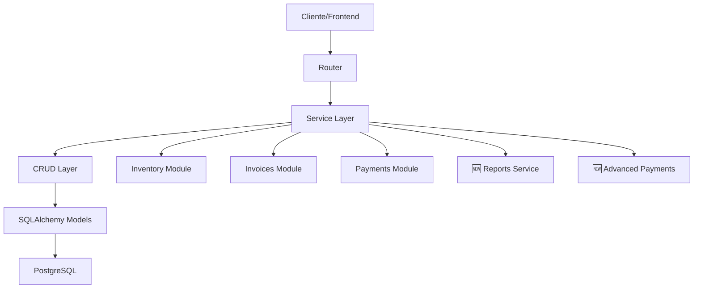

# 🛒 Módulo POS (Point of Sale) - Ally360

**Sistema completo de Punto de Venta** para el ERP SaaS Ally360, diseñado para **retailers, restaurantes y negocios de servicios** que requieren un POS moderno, escalable y multi-tenant.

---

## 📋 Tabla de Contenidos

1. [🎯 Características Principales](#-características-principales)
2. [🚀 Características Avanzadas v1.2.0](#-características-avanzadas-v120)
3. [🏗️ Arquitectura](#️-arquitectura)
4. [📊 Modelos de Datos](#-modelos-de-datos)
5. [🔧 Servicios](#-servicios)
6. [🌐 API Endpoints](#-api-endpoints)
7. [💼 Casos de Uso](#-casos-de-uso)
8. [🛡️ Seguridad](#️-seguridad)
9. [📈 Performance](#-performance)
10. [🔮 Roadmap](#-roadmap)

---

## 🎯 Características Principales

### 🏪 Gestión de Cajas Registradoras
- **Caja única por PDV** con validaciones estrictas
- **Apertura con saldo inicial** configurable
- **Cierre automático** con arqueo y cálculo de diferencias
- **Auditoría completa** de usuarios y horarios
- **Generación automática de nombres** con fecha

### 💰 Movimientos de Caja
- **5 tipos de movimientos**: Venta, Depósito, Retiro, Gasto, Ajuste
- **Cálculo en tiempo real** del saldo de caja
- **Integración automática** con ventas POS
- **Manejo de vuelto** y sobrepagos
- **Referencias cruzadas** con facturas

### 👥 Gestión de Vendedores
- **CRUD completo** con soft delete
- **Sistema de comisiones** personalizable
- **Validaciones únicas** por tenant
- **Información de contacto** completa
- **Salario base** configurable

### 🛍️ Proceso de Ventas
- **Flujo completo integrado** con Inventory, Invoices y Payments
- **Múltiples productos** por venta
- **Múltiples métodos de pago** por transacción
- **Actualización automática** de inventario
- **Generación automática** de documentos fiscales

---

## 🚀 Características Avanzadas v1.2.0

### 📊 Reportes Avanzados POS

#### 1. 👨‍💼 Ventas por Vendedor
```python
# Análisis completo de performance individual
{
    "seller_name": "Juan Pérez",
    "total_sales": 45,
    "total_amount": 2847500.00,
    "average_ticket": 63277.78,
    "commission_estimated": 142375.00,
    "active_days": 12,
    "market_share": 15.8,
    "ranking": 2,
    "consistency_score": 8.5,
    "trend": "upward"
}
```

**Métricas incluidas:**
- 📈 Total de ventas y montos
- 💰 Comisiones estimadas
- 🎯 Ticket promedio y participación
- 📅 Días activos y consistencia
- 🏆 Ranking y tendencias

#### 2. 🔍 Arqueos Detallados
```python
# Análisis histórico de precisión en arqueos
{
    "total_cash_registers": 25,
    "exact_count": 18,
    "overages_count": 4,
    "shortages_count": 3,
    "average_difference": -245.67,
    "accuracy_percentage": 72.0,
    "trend_analysis": "improving",
    "recommendations": ["Implementar conteo doble en cierres"]
}
```

**Análisis incluido:**
- ✅ Precisión y tendencias históricas
- 💸 Sobrantes vs faltantes
- 📊 Recomendaciones automáticas
- 🎯 KPIs de precisión

#### 3. ⏰ Análisis de Turnos
```python
# Comparación de performance por horarios
{
    "morning_shift": {  # 6:00 - 14:00
        "sales_count": 25,
        "total_amount": 1250000.00,
        "active_sellers": 3,
        "average_ticket": 50000.00
    },
    "afternoon_shift": {  # 14:00 - 22:00
        "sales_count": 42,
        "total_amount": 2100000.00,
        "active_sellers": 5,
        "average_ticket": 50000.00
    },
    "night_shift": {  # 22:00 - 6:00
        "sales_count": 8,
        "total_amount": 320000.00,
        "active_sellers": 1,
        "average_ticket": 40000.00
    }
}
```

**Insights automáticos:**
- 🌅 Comparación mañana vs tarde vs noche
- 👥 Vendedores activos por turno
- 💡 Recomendaciones de optimización
- 📈 Tendencias horarias

#### 4. 🏆 Top Productos POS
```python
# Ranking de productos más vendidos
{
    "product_name": "Coca Cola 600ml",
    "total_quantity": 145,
    "total_revenue": 435000.00,
    "sales_count": 89,
    "market_share": 12.5,
    "ranking": 1,
    "hhi_contribution": 156.25,
    "consistency_days": 15
}
```

**Análisis incluido:**
- 🎯 Ranking por cantidad y revenue
- 📊 Índice de concentración (HHI)
- 🔄 Productos más consistentes
- 💹 Participación en ventas totales

### 💳 Métodos de Pago Avanzados

#### 1. 🔄 Pagos Mixtos
**Combinación de múltiples métodos** en una sola transacción:

```python
# Ejemplo: Pago de $100,000 dividido
{
    "invoice_id": "inv_123",
    "total_amount": 100000.00,
    "payments": [
        {
            "method": "cash",
            "amount": 50000.00,
            "reference": "Efectivo"
        },
        {
            "method": "card",
            "amount": 30000.00,
            "reference": "Visa ****1234"
        },
        {
            "method": "qr_code",
            "amount": 20000.00,
            "reference": "Nequi QR"
        }
    ],
    "change": 0.00
}
```

**Características:**
- ✅ **Validación automática** de montos totales
- 💸 **Cálculo de vuelto** inteligente
- 🏦 **Integración con caja** automática
- 📝 **Registro independiente** por método

#### 2. 📱 Códigos QR (Billeteras Digitales)
**Soporte completo para billeteras colombianas:**

```python
# Generación de QR para Nequi
{
    "qr_id": "qr_unique_123",
    "provider": "nequi",
    "amount": 25000.00,
    "qr_data": "nequi://pay?amount=25000&ref=POS_12345",
    "instructions": "Abra Nequi > Pagar con QR > Escanee el código",
    "expires_at": "2025-01-08T10:30:00Z",
    "status": "pending"
}
```

**Proveedores soportados:**
- 🟣 **Nequi**: Bancolombia
- 🔵 **DaviPlata**: Davivienda  
- 🟡 **Bancolombia QR**: Tarjetas y cuentas
- 🏛️ **PSE**: Pagos Seguros en Línea

**Flujo completo:**
1. 📱 **Generación**: QR único con expiración
2. 👀 **Verificación**: Estado en tiempo real
3. ✅ **Confirmación**: Integración automática
4. 💾 **Registro**: Trazabilidad completa

---

## 🏗️ Arquitectura

### 📁 Estructura de Archivos
```
app/modules/pos/
├── 📄 __init__.py          # Configuración del módulo
├── 📄 models.py            # Modelos SQLAlchemy
├── 📄 schemas.py           # Validaciones Pydantic
├── 📄 crud.py              # Operaciones de base de datos
├── 📄 service.py           # Lógica de negocio principal
├── 📄 reports.py           # 🆕 Servicios de reportes avanzados
├── 📄 payments.py          # 🆕 Servicios de pagos avanzados
├── 📄 router.py            # Endpoints API principales
├── 📄 dependencies.py      # Inyección de dependencias
├── 📄 exceptions.py        # Excepciones personalizadas
├── 📄 CHANGELOG.md         # Historial de cambios
└── 📄 README.md            # Esta documentación
```

### 🔄 Flujo de Datos



### 🧩 Principios de Diseño

1. **🎯 Separación de responsabilidades**
   - **Router**: Solo endpoints y validación HTTP
   - **Service**: Lógica de negocio y orquestación
   - **CRUD**: Acceso a datos optimizado
   - **Models**: Estructura y relaciones

2. **🔒 Multi-tenancy estricto**
   - Filtrado automático por `tenant_id`
   - Validación de pertenencia en cada operación
   - Aislamiento completo entre tenants

3. **⚡ Performance first**
   - Queries optimizadas con índices estratégicos
   - Cálculos en SQL vs loops en memoria
   - Lazy loading y propiedades calculadas

4. **🛡️ Seguridad por diseño**
   - Validación estricta de permisos
   - Límites configurables por tenant
   - Auditoría completa de operaciones

---

## 📊 Modelos de Datos

### 🏪 CashRegister (Caja Registradora)
```python
class CashRegister(Base, TenantMixin):
    __tablename__ = "cash_registers"
    
    id: UUID              # Identificador único
    tenant_id: UUID       # Multi-tenancy
    location_id: UUID     # PDV/Sucursal
    name: str             # "Caja Principal - 20250108"
    opening_balance: Decimal   # Saldo inicial
    closing_balance: Decimal   # Saldo final (nullable)
    status: CashRegisterStatus # open/closed
    opened_by: UUID       # Usuario apertura
    closed_by: UUID       # Usuario cierre (nullable)
    opened_at: datetime   # Timestamp apertura
    closed_at: datetime   # Timestamp cierre (nullable)
    opening_notes: str    # Notas apertura (nullable)
    closing_notes: str    # Notas cierre (nullable)
    
    # Relaciones
    movements: List[CashMovement]
    
    # Propiedades calculadas
    @property
    def current_balance(self) -> Decimal:
        """Saldo actual calculado en tiempo real"""
        
    @property
    def total_sales(self) -> Decimal:
        """Total de ventas del período"""
        
    @property
    def cash_difference(self) -> Decimal:
        """Diferencia en arqueo (real vs teórico)"""
```

### 💰 CashMovement (Movimiento de Caja)
```python
class CashMovement(Base, TenantMixin):
    __tablename__ = "cash_movements"
    
    id: UUID                    # Identificador único
    tenant_id: UUID             # Multi-tenancy
    cash_register_id: UUID      # Caja asociada
    type: MovementType          # SALE/DEPOSIT/WITHDRAWAL/EXPENSE/ADJUSTMENT
    amount: Decimal             # Monto (+ entrada, - salida)
    description: str            # Descripción del movimiento
    reference: str              # Referencia externa (opcional)
    invoice_id: UUID            # Factura asociada (nullable)
    created_by: UUID            # Usuario que creó
    created_at: datetime        # Timestamp
    
    # Relaciones
    cash_register: CashRegister
    invoice: Invoice            # Relación con módulo invoices
```

### 👥 Seller (Vendedor)
```python
class Seller(Base, TenantMixin):
    __tablename__ = "sellers"
    
    id: UUID              # Identificador único
    tenant_id: UUID       # Multi-tenancy
    user_id: UUID         # Usuario del sistema (nullable)
    name: str             # Nombre completo
    email: str            # Email único por tenant
    phone: str            # Teléfono (nullable)
    document_number: str  # Documento único por tenant
    commission_rate: Decimal  # Tasa de comisión (nullable)
    base_salary: Decimal      # Salario base (nullable)
    is_active: bool = True    # Soft delete
    
    # Relaciones
    invoices: List[Invoice]   # Ventas del vendedor
    
    # Propiedades calculadas
    @property
    def total_sales_count(self) -> int:
        """Total de ventas realizadas"""
        
    @property
    def total_sales_amount(self) -> Decimal:
        """Monto total vendido"""
```

---

## 🔧 Servicios

### 🏪 POSService (Servicio Principal)
**Orquesta todo el proceso de venta POS:**

```python
class POSService:
    async def process_sale(
        self, 
        sale_data: POSSaleCreate, 
        db: AsyncSession,
        current_user: User,
        tenant_id: UUID
    ) -> POSSaleResponse:
        """
        Proceso completo de venta POS con validaciones
        e integraciones automáticas
        """
```

**Validaciones incluidas:**
- ✅ Caja abierta obligatoria
- ✅ Stock suficiente por producto
- ✅ Vendedor activo y válido
- ✅ Montos de pago vs total de venta
- ✅ Permisos del usuario actual

**Integraciones automáticas:**
- 📦 **Inventory**: Descuento automático de stock
- 🧾 **Invoices**: Generación de factura fiscal
- 💳 **Payments**: Registro de pagos por método
- 💰 **Cash**: Movimientos automáticos de caja

### 📊 POSReportsService (Reportes Avanzados) 🆕
**Análisis completo de performance POS:**

```python
class POSReportsService:
    async def get_sales_by_seller_report(
        self,
        date_range: DateRange,
        seller_id: Optional[UUID],
        db: AsyncSession,
        tenant_id: UUID
    ) -> SalesBySellerResponse:
        """Reporte detallado de ventas por vendedor"""
        
    async def get_cash_audit_report(
        self,
        date_range: DateRange,
        location_id: Optional[UUID],
        db: AsyncSession,
        tenant_id: UUID
    ) -> CashAuditResponse:
        """Análisis de arqueos y precisión histórica"""
        
    async def get_shift_analysis_report(
        self,
        date_range: DateRange,
        location_id: Optional[UUID],
        db: AsyncSession,
        tenant_id: UUID
    ) -> ShiftAnalysisResponse:
        """Comparación de performance por turnos"""
        
    async def get_top_products_report(
        self,
        date_range: DateRange,
        location_id: Optional[UUID],
        limit: int,
        db: AsyncSession,
        tenant_id: UUID
    ) -> TopProductsResponse:
        """Ranking de productos más vendidos"""
```

### 💳 AdvancedPaymentService (Pagos Avanzados) 🆕
**Procesamiento de métodos de pago complejos:**

```python
class AdvancedPaymentService:
    async def process_mixed_payment(
        self,
        payment_data: MixedPaymentRequest,
        db: AsyncSession,
        current_user: User,
        tenant_id: UUID
    ) -> MixedPaymentResponse:
        """Procesamiento de pagos con múltiples métodos"""
        
    async def generate_qr_payment(
        self,
        qr_data: QRPaymentRequest,
        db: AsyncSession,
        current_user: User,
        tenant_id: UUID
    ) -> QRPaymentResponse:
        """Generación de códigos QR para billeteras"""
        
    async def verify_qr_payment_status(
        self,
        status_data: QRPaymentStatusRequest,
        db: AsyncSession,
        tenant_id: UUID
    ) -> QRPaymentStatusResponse:
        """Verificación de estado de pago QR"""
        
    async def validate_payment_limits(
        self,
        amount: Decimal,
        method: PaymentMethod,
        tenant_id: UUID
    ) -> PaymentValidationResponse:
        """Validación de límites por método de pago"""
```

---

## 🌐 API Endpoints

### 🏪 Gestión de Cajas Registradoras

#### `POST /cash-registers/open` - Abrir Caja
```json
{
    "location_id": "550e8400-e29b-41d4-a716-446655440000",
    "opening_balance": 100000.00,
    "opening_notes": "Apertura turno mañana"
}
```

#### `POST /cash-registers/{id}/close` - Cerrar Caja
```json
{
    "closing_balance": 895750.00,
    "closing_notes": "Arqueo sin diferencias"
}
```

#### `GET /cash-registers/current` - Caja Actual
Devuelve la caja abierta actual del PDV.

### 💰 Movimientos de Caja

#### `POST /cash-movements` - Crear Movimiento
```json
{
    "type": "deposit",
    "amount": 50000.00,
    "description": "Depósito inicial turno",
    "reference": "DEP-001"
}
```

#### `GET /cash-movements` - Listar Movimientos
Con filtros por tipo, fecha y rango de montos.

### 👥 Gestión de Vendedores

#### `POST /sellers` - Crear Vendedor
```json
{
    "name": "Ana García",
    "email": "ana.garcia@empresa.com",
    "phone": "+573001234567",
    "document_number": "12345678",
    "commission_rate": 5.0,
    "base_salary": 1200000.00
}
```

#### `GET /sellers` - Listar Vendedores
Con búsqueda por nombre y filtro de activos.

### 🛍️ Proceso de Ventas

#### `POST /sales` - Procesar Venta
```json
{
    "seller_id": "550e8400-e29b-41d4-a716-446655440000",
    "customer_name": "Cliente Final",
    "customer_email": "cliente@email.com",
    "items": [
        {
            "product_id": "660e8400-e29b-41d4-a716-446655440000",
            "quantity": 2,
            "unit_price": 25000.00
        }
    ],
    "payments": [
        {
            "method": "cash",
            "amount": 50000.00,
            "reference": "Efectivo"
        }
    ],
    "notes": "Venta mostrador"
}
```

### 📊 Reportes Avanzados 🆕

#### `POST /reports/sales-by-seller` - Ventas por Vendedor
```json
{
    "start_date": "2025-01-01",
    "end_date": "2025-01-31",
    "seller_id": null  // Opcional, todos los vendedores
}
```

**Respuesta detallada:**
```json
{
    "period": {
        "start_date": "2025-01-01",
        "end_date": "2025-01-31",
        "days_count": 31
    },
    "sellers": [
        {
            "seller_id": "550e8400-e29b-41d4-a716-446655440000",
            "seller_name": "Juan Pérez",
            "total_sales": 45,
            "total_amount": 2847500.00,
            "average_ticket": 63277.78,
            "commission_estimated": 142375.00,
            "active_days": 12,
            "market_share": 15.8,
            "ranking": 2,
            "consistency_score": 8.5,
            "trend": "upward"
        }
    ],
    "summary": {
        "total_sellers": 8,
        "total_sales": 285,
        "total_amount": 18000000.00,
        "average_per_seller": 2250000.00
    }
}
```

#### `POST /reports/cash-audit` - Arqueos Detallados
```json
{
    "start_date": "2025-01-01",
    "end_date": "2025-01-31",
    "location_id": null  // Opcional, todas las ubicaciones
}
```

#### `POST /reports/shift-analysis` - Análisis de Turnos
```json
{
    "start_date": "2025-01-01",
    "end_date": "2025-01-31",
    "location_id": null
}
```

#### `POST /reports/top-products` - Top Productos
```json
{
    "start_date": "2025-01-01",
    "end_date": "2025-01-31",
    "location_id": null,
    "limit": 20  // Top 20 productos
}
```

### 💳 Pagos Avanzados 🆕

#### `POST /payments/mixed` - Pago Mixto
```json
{
    "invoice_id": "770e8400-e29b-41d4-a716-446655440000",
    "payments": [
        {
            "method": "cash",
            "amount": 50000.00,
            "reference": "Efectivo cliente"
        },
        {
            "method": "card",
            "amount": 30000.00,
            "reference": "Visa ****1234"
        },
        {
            "method": "qr_code",
            "amount": 20000.00,
            "reference": "Nequi QR"
        }
    ]
}
```

#### `POST /payments/qr/generate` - Generar QR
```json
{
    "amount": 25000.00,
    "provider": "nequi",
    "reference": "POS_SALE_123",
    "description": "Pago venta mostrador"
}
```

**Respuesta:**
```json
{
    "qr_id": "qr_unique_123",
    "qr_data": "nequi://pay?amount=25000&ref=POS_12345",
    "provider": "nequi",
    "amount": 25000.00,
    "instructions": "Abra Nequi > Pagar con QR > Escanee el código",
    "expires_at": "2025-01-08T10:30:00Z",
    "status": "pending"
}
```

#### `POST /payments/qr/status` - Estado QR
```json
{
    "qr_id": "qr_unique_123"
}
```

#### `POST /payments/validate` - Validar Límites
```json
{
    "amount": 500000.00,
    "method": "qr_code"
}
```

---

## 💼 Casos de Uso

### 🛍️ Caso 1: Venta Simple Efectivo

**Escenario:** Cliente compra 2 productos, paga en efectivo.

```python
# 1. Abrir caja (si no está abierta)
POST /cash-registers/open
{
    "location_id": "pdv_001",
    "opening_balance": 100000.00
}

# 2. Procesar venta
POST /sales
{
    "seller_id": "seller_001",
    "customer_name": "Cliente Final",
    "items": [
        {
            "product_id": "prod_001",
            "quantity": 2,
            "unit_price": 15000.00
        }
    ],
    "payments": [
        {
            "method": "cash",
            "amount": 35000.00  // Cliente da $35k por $30k
        }
    ]
}

# Resultado automático:
# ✅ Factura generada
# ✅ Stock actualizado (-2 unidades)
# ✅ Movimiento de caja (+$30k SALE)
# ✅ Pago registrado ($30k efectivo)
# ✅ Vuelto calculado ($5k)
```

### 💳 Caso 2: Venta con Pago Mixto

**Escenario:** Cliente compra por $100k, paga $50k efectivo + $50k tarjeta.

```python
# Procesar pago mixto
POST /payments/mixed
{
    "invoice_id": "inv_123",
    "payments": [
        {
            "method": "cash",
            "amount": 50000.00,
            "reference": "Efectivo"
        },
        {
            "method": "card",
            "amount": 50000.00,
            "reference": "Visa ****1234"
        }
    ]
}

# Resultado automático:
# ✅ Validación monto total vs factura
# ✅ Dos registros de pago independientes
# ✅ Movimiento de caja solo por efectivo
# ✅ Cálculo de vuelto si aplica
```

### 📱 Caso 3: Pago con QR (Nequi)

**Escenario:** Cliente quiere pagar con Nequi usando QR.

```python
# 1. Generar código QR
POST /payments/qr/generate
{
    "amount": 45000.00,
    "provider": "nequi",
    "reference": "POS_SALE_789"
}

# 2. Mostrar QR al cliente
# Cliente escanea con app Nequi

# 3. Verificar estado (polling cada 3s)
POST /payments/qr/status
{
    "qr_id": "qr_unique_789"
}

# Estados posibles:
# - "pending": Esperando pago
# - "processing": En proceso
# - "completed": Pagado exitosamente
# - "failed": Falló el pago
# - "expired": QR expirado
```

### 📊 Caso 4: Reporte de Vendedores

**Escenario:** Gerente quiere ver performance del mes.

```python
# Generar reporte mensual
POST /reports/sales-by-seller
{
    "start_date": "2025-01-01",
    "end_date": "2025-01-31"
}

# Análisis automático incluye:
# 📈 Ranking de vendedores
# 💰 Comisiones estimadas
# 🎯 Metas vs realizado
# 📊 Tendencias y consistencia
# 💡 Recomendaciones automáticas
```

### 🔍 Caso 5: Arqueo de Caja

**Escenario:** Final del día, cerrar y auditar caja.

```python
# 1. Contar dinero físico en caja
# 2. Cerrar caja con balance real
POST /cash-registers/{id}/close
{
    "closing_balance": 895750.00,
    "closing_notes": "Arqueo con faltante $4,250"
}

# 3. Ver reporte de auditoría
POST /reports/cash-audit
{
    "start_date": "2025-01-08",
    "end_date": "2025-01-08"
}

# Resultado automático:
# ✅ Cálculo diferencia vs teórico
# ✅ Movimiento de ajuste automático
# ✅ Análisis de tendencias
# ✅ Recomendaciones de mejora
```

---

## 🛡️ Seguridad

### 🔐 Control de Acceso (RBAC)

#### Roles y Permisos
| Acción | Owner | Admin | Seller | Cashier | Accountant |
|--------|-------|-------|---------|---------|------------|
| Abrir/Cerrar Caja | ✅ | ✅ | ✅ | ✅ | ❌ |
| Procesar Ventas | ✅ | ✅ | ✅ | ✅ | ❌ |
| Ver Reportes | ✅ | ✅ | ❌ | ❌ | ✅ |
| Gestionar Vendedores | ✅ | ✅ | ❌ | ❌ | ❌ |
| Movimientos Caja | ✅ | ✅ | ✅* | ✅* | ❌ |
| Arqueos Históricos | ✅ | ✅ | ❌ | ❌ | ✅ |

*Solo movimientos propios y de su caja

### 🚨 Validaciones de Seguridad

#### Multi-tenancy Estricto
```python
# Todas las queries incluyen tenant_id automáticamente
WHERE cr.tenant_id = :tenant_id 
    AND cr.location_id IN (user_allowed_locations)
```

#### Límites Configurables
```python
class PaymentLimits:
    CASH_MAX_DAILY = 5_000_000      # $5M diarios efectivo
    QR_MAX_TRANSACTION = 2_000_000   # $2M por QR
    CARD_MIN_AMOUNT = 10_000         # Mín $10k tarjeta
    
    # Por tenant y personalizables
```

#### Detección de Patrones Sospechosos
- 🚨 **Ventas inusuales**: Montos muy altos para el perfil
- 🔍 **Arqueos sistemáticos**: Diferencias recurrentes
- ⏰ **Horarios extraños**: Ventas fuera de horario
- 💰 **Movimientos de caja**: Retiros frecuentes/grandes

### 🔒 Auditoría Completa

#### Tabla de Auditoría
```python
class AuditLog(Base, TenantMixin):
    action: str           # "POS_SALE", "CASH_OPEN", etc.
    entity_type: str      # "CashRegister", "Sale"
    entity_id: UUID       # ID del registro afectado
    user_id: UUID         # Usuario que ejecutó
    old_values: JSON      # Estado anterior
    new_values: JSON      # Estado nuevo
    ip_address: str       # IP del cliente
    user_agent: str       # Navegador/app
    created_at: datetime  # Timestamp
```

---

## 📈 Performance

### ⚡ Optimizaciones de Queries

#### Índices Estratégicos
```sql
-- Para reportes de vendedores
CREATE INDEX idx_invoices_pos_seller_date_amount 
ON invoices(tenant_id, seller_id, issue_date, total_amount) 
WHERE type = 'pos';

-- Para análisis de turnos
CREATE INDEX idx_invoices_pos_created_hour 
ON invoices(tenant_id, extract(hour from created_at), issue_date) 
WHERE type = 'pos';

-- Para top productos
CREATE INDEX idx_invoice_line_items_product_quantity 
ON invoice_line_items(product_id, quantity, line_total);

-- Para arqueos
CREATE INDEX idx_cash_registers_closed_date 
ON cash_registers(tenant_id, date(closed_at), status) 
WHERE status = 'closed';
```

#### Cálculos en SQL vs Python
```python
# ❌ Lento: Loop en Python
total = 0
for invoice in invoices:
    total += invoice.total_amount

# ✅ Rápido: Agregación SQL
total = await db.scalar(
    select(func.sum(Invoice.total_amount))
    .where(Invoice.tenant_id == tenant_id)
)
```

### 📊 Propiedades Calculadas

#### Cache en Memoria
```python
class CashRegister(Base):
    _current_balance: Optional[Decimal] = None
    
    @property
    def current_balance(self) -> Decimal:
        """Balance calculado con cache en memoria"""
        if self._current_balance is None:
            self._current_balance = self._calculate_balance()
        return self._current_balance
```

### 🔄 Paginación Inteligente

#### Keyset Pagination para Grandes Datasets
```python
# Para listas grandes (>10k registros)
async def get_paginated_sales(
    cursor: Optional[datetime] = None,
    limit: int = 50
) -> List[Invoice]:
    query = select(Invoice).where(Invoice.tenant_id == tenant_id)
    
    if cursor:
        query = query.where(Invoice.created_at > cursor)
    
    return await db.execute(
        query.order_by(Invoice.created_at).limit(limit)
    )
```

---

## 🔮 Roadmap

### 🚀 v1.3.0 - Multi-Caja & Analytics (Q1 2026)

#### 🏪 Multi-Caja por PDV
```python
# Múltiples cajas abiertas simultáneamente
class MultiCashSession:
    primary_register_id: UUID      # Caja principal
    secondary_registers: List[UUID] # Cajas adicionales
    shift_manager_id: UUID         # Supervisor del turno
    
    # Distribución automática de ventas
    # Consolidación al cierre
    # Arqueo conjunto
```

#### 📈 Analytics en Tiempo Real
```python
# Dashboard live con WebSockets
class LiveAnalytics:
    current_sales_count: int       # Ventas del día
    current_revenue: Decimal       # Revenue en tiempo real
    top_seller_today: str          # Mejor vendedor
    active_registers: int          # Cajas abiertas
    
    # Alertas automáticas
    # Stock bajo en productos top
    # Metas de venta próximas
    # Diferencias en arqueos
```

### 🌟 v1.4.0 - Mobile & Offline (Q2 2026)

#### 📱 API Móvil Optimizada
- Endpoints específicos para apps móviles
- Payload reducido y comprimido
- Sincronización diferida
- Modo offline con cola

#### 🔄 Sincronización Offline
- Base de datos local SQLite
- Sincronización automática al reconectar
- Resolución de conflictos inteligente
- Queue de operaciones pendientes

### 🤖 v2.0.0 - AI & Enterprise (Q3 2026)

#### Inteligencia Artificial
- **Detección de fraude**: Patrones sospechosos automáticos
- **Optimización turnos**: ML para mejores horarios
- **Predicción demanda**: Stock óptimo por PDV
- **Customer insights**: Análisis comportamiento de clientes

#### Features Empresariales
- **Omnichannel**: Inventario unificado online/offline
- **Seguridad avanzada**: Biometría y auditoría forense
- **Integración ERP**: Conexión con SAP, Oracle, etc.
- **Business Intelligence**: Dashboards ejecutivos

---

## 🤝 Contribución

### 📋 Checklist para Nuevas Features

- [ ] **Multi-tenancy**: ¿Filtra por `tenant_id`?
- [ ] **Validaciones**: ¿Pydantic schemas completos?
- [ ] **Permisos**: ¿RBAC implementado correctamente?
- [ ] **Tests**: ¿Unit tests + integration tests?
- [ ] **Documentación**: ¿README y CHANGELOG actualizados?
- [ ] **Performance**: ¿Queries optimizadas con índices?
- [ ] **Seguridad**: ¿Validaciones de límites y auditoría?

### 🧪 Testing Strategy

#### Unit Tests
```python
# Test aislado de lógica de negocio
def test_calculate_commission():
    seller = Seller(commission_rate=5.0)
    commission = seller.calculate_commission(100000.00)
    assert commission == 5000.00
```

#### Integration Tests
```python
# Test multi-tenant isolation
async def test_sales_isolation_between_tenants():
    # Crear venta en tenant A
    # Intentar acceder desde tenant B
    # Debe fallar con 404 o 403
```

#### Contract Tests
```python
# Test de conformidad OpenAPI
def test_api_schema_compliance():
    # Validar que responses coinciden con schemas
    # Validar que todos los endpoints están documentados
```

---

## 📞 Soporte

### 🐛 Reportar Issues
- Usar GitHub Issues con template
- Incluir logs y steps to reproduce
- Especificar versión y ambiente

### 📚 Documentación Adicional
- [📋 CHANGELOG.md](./CHANGELOG.md) - Historial detallado
- [🔧 API Reference](./docs/api.md) - Documentación OpenAPI
- [🧪 Testing Guide](./docs/testing.md) - Guía de pruebas
- [🚀 Deployment](./docs/deployment.md) - Guía de despliegue

---

## 📄 Licencia

Este proyecto es propiedad de **Ally360** y está protegido por derechos de autor.
Uso restringido a desarrollo interno y clientes autorizados.

---

**¡Gracias por usar el módulo POS de Ally360!** 🛒✨

*¿Tienes preguntas o sugerencias? Contacta al equipo de desarrollo.*